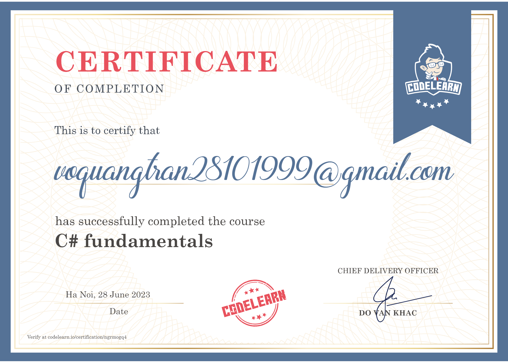

# This is my exercises on C# Basic Syntax on CodeLearn.io

## Exercise Link: [Link](https://codelearn.io/learning/csharp-fundamentals).
## Certificate Link: [Link](https://codelearn.io/certification/ngrmogq4)

<!--  -->

